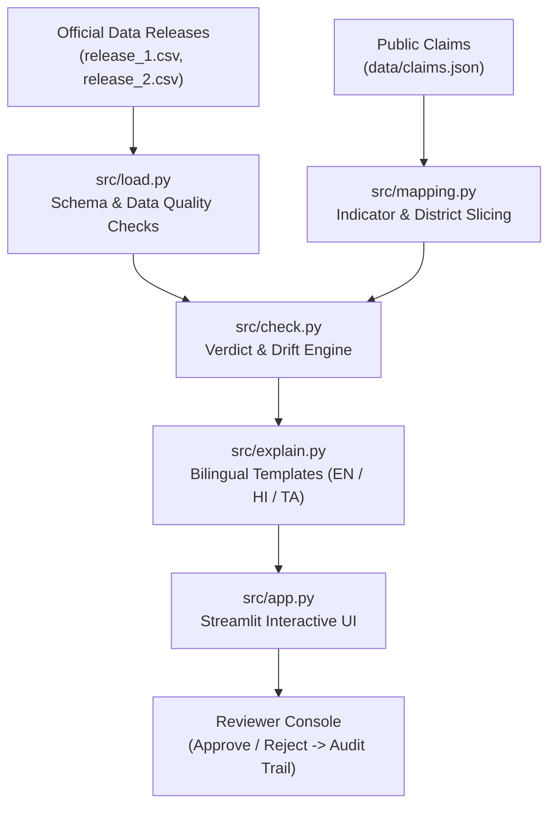

# 🛡️ Public Health Claim Watchdog (Free Tools Only)

> **Hack for Social Cause Prototype**  
> An auditable, deterministic, and open-source public health claim verification system that monitors government health data releases, flags revision drift, and produces bilingual explanations with human-in-the-loop oversight.

[]()
[](LICENSE)
[]()
[]()

---

## 📌 Problem Statement
Public health claims made by political campaigns, media outlets, and health agencies often cite initial **provisional health indicators** (e.g. child immunization or institutional births). When state health departments release official **audited revisions** months later, historical indicators often change downward or upward.

Without automated monitoring:
1. Outdated or invalidated claims continue circulating unchecked.
2. Journalists and citizens lack quick, explainable verification against official releases.
3. Machine-learning "black boxes" fail to provide reproducible mathematical evidence.
4. Data quality anomalies (e.g., missing values or spelling inconsistencies) get erroneously labeled as "False/Unsupported".

**Claim Watchdog** solves this through deterministic rules, transparent evidence tables, automatic **Data Drift Alerts**, bilingual summaries, and a human-in-the-loop reviewer approval pipeline.

---

## 🏗️ Architecture & Data Flow



### Flow Breakdown:
1. `data/claims.json` defines structured claims (indicator, district, period, direction, claimed magnitude, tolerance).
2. `src/mapping.py` links the claim to the canonical indicator column and filters the target district.
3. `src/load.py` normalizes district aliases and runs 5 strict pre-verdict data-quality checks.
4. `src/check.py` deterministically recomputes delta changes for each release, checks directional/magnitude alignment, and detects **Revision Drift**.
5. `src/explain.py` generates native bilingual summaries (English, Hindi, Tamil).
6. `src/app.py` presents an interactive dashboard with before/after toggles, evidence tables, drift alerts, and reviewer sign-off.

---

## 🚀 Quickstart Guide (Run in Under 3 Minutes)

### 1. Prerequisites
- Python 3.11 or higher
- Git

### 2. Clone & Setup
```bash
# Navigate to project directory
cd "D:\Hack for cause"

# Install lightweight free dependencies
pip install -r requirements.txt
```

### 3. Run Test Suite
```bash
# Run all 12 unit tests
python -m pytest -v
```

### 4. Run CLI Pipeline (No UI / Offline Fallback)
```bash
# Run verification and drift detection directly in terminal
python src/cli.py en    # English
python src/cli.py hi    # Hindi
```

### 5. Launch Interactive Streamlit UI
```bash
streamlit run src/app.py
```
Open your browser to `http://localhost:8501`.

---

## 🧪 Checkpoint-Wise Demo Walkthrough

### Checkpoint 1: Official Data Loading & Quality Guardrails (`src/load.py`)
- **Action:** Validates dataset releases against required columns, normalized district spellings (`Poona` ➡️ `Pune`), and plausible ranges (0–100%).
- **Verification Rule:** If any check fails (e.g., missing data in Nashik ANC), the status is **`Needs review`**, *never* erroneously marked `Unsupported`.

### Checkpoint 2: Deterministic Core Logic & Test Suite (`src/check.py`)
- **Supported:** Direction matches and magnitude is within tolerance.
- **Unsupported:** Direction or magnitude diverges, and data quality checks passed.
- **Needs Review:** Missing value, invalid period, or unmapped district.
- **Verification:** Run `pytest -v` — all 12 tests pass validating each condition.

### Checkpoint 3: The Revision Drift Story (Flagship Demo)
- **Claim 1 (CLM-001):** *"Full child immunization coverage in Pune district rose by over 8.5% between 2021 and 2022..."*
- **Before (`release_1.csv` - Provisional):**
  - Baseline (2021): `72.4%` | Comparison (2022): `81.9%` | Delta: **`+9.5%`**
  - Result: **Supported ✅**
- **After (`release_2.csv` - Audited Revision):**
  - Baseline (2021): `74.1%` | Comparison (2022): `77.3%` | Delta: **`+3.2%`**
  - Result: **Unsupported ❌**
  - **Watchdog Trigger:** 🚨 **CRITICAL REVISION DRIFT ALERT** automatically fired!

### Checkpoint 4: Verifiable Evidence Table & Bilingual Explanations
- UI renders an exact arithmetic breakdown so any citizen or judge can verify the math.
- Instant toggle between **English**, **हिंदी (Hindi)**, and **தமிழ் (Tamil)** using vetted pre-written templates.

### Checkpoint 5: Human-in-the-Loop Reviewer Sign-Off
- Reviewer types notes and clicks **`✅ Approve & Publish Alert`** or **`❌ Reject Alert`**.
- Instant append to `st.session_state.audit_trail` with live CSV download.

---

## 🎙️ 3-Minute Hackathon Pitch Script

| Time | Slide / Step | What to Say & Do |
|---|---|---|
| **0:00 - 0:30** | **1. The Problem** | *"When public health officials or campaigns announce achievements—like 'immunization rose 8.5% in Pune'—citizens and journalists take it as fact. But months later, governments publish audited revisions that quietly change those figures. No one catches it."* |
| **0:30 - 0:50** | **2. The Setup** | *Show Claim CLM-001 on the Claim Watchdog UI. "Here is the exact claim linked to its official Health Management Information System release."* |
| **0:50 - 1:20** | **3. Before (Release 1)** | *"Under Release 1 (provisional data), Pune jumped from 72.4% to 81.9%, a +9.5% gain. Our system verifies this mathematically and marks it **Supported**, displaying the reproducible evidence table."* |
| **1:20 - 1:40** | **4. The Revision (Release 2)** | *Switch the radio button to Release 2. "Now, state auditors release the audited annual data. Watch what happens..."* |
| **1:40 - 2:20** | **5. The Drift Alert** | *"The verified delta drops to only +3.2%! The claim is immediately downgraded to **Unsupported**, triggering an automatic **Critical Revision Drift Alert**. Here it is explained clearly in English, Hindi, and Tamil."* |
| **2:20 - 2:40** | **6. Human Review** | *"Before anything is broadcast to the public, an editor reviews the finding and clicks **Approve & Publish Alert**, preserving an immutable audit trail."* |
| **2:40 - 3:00** | **7. Close** | *"Zero paid APIs, 100% open source, operates completely offline, and lets any health desk or citizen monitor government statistics reliably. Thank you!"* |

---

## 📊 Dataset Information & Terms of Use
- **Sources:** Simulated based on publicly available structures from [data.gov.in](https://data.gov.in) and the Ministry of Health & Family Welfare (MoHFW) Health Management Information System (HMIS).
- **Files:**
  - `data/raw/release_1.csv`: Provisional district-level health data (provisional release).
  - `data/raw/release_2.csv`: Annual quality-audited district-level health data (revised release).
- **Terms:** Open Government Data License (OGDL) / Open Source compatible.

---

## ⚠️ Known Limitations & Scope Boundaries
1. **Free / Local Scope:** Built exclusively with free open-source tools (Python, Pandas, Streamlit, Pytest); intentionally avoids paid LLM APIs to ensure zero operating cost.
2. **Current Datasets:** Seeded with two official release snapshots across 5 districts for demonstration.
3. **Regex Parser Scope:** The free-text parser handles standard phrasing (rose/increased/fell by X% in District between Y and Z). Complex edge-case sentences can be entered directly via structured JSON.

---

## 📜 License
Distributed under the [MIT License](LICENSE).
