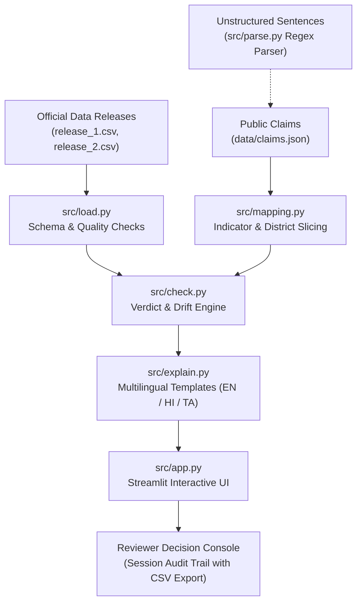

# 🛡️ Public Health Claim Watchdog (Free Tools Only)

> **Hack for Social Cause Prototype — Tamil Nadu State Focus**  
> An auditable, deterministic, and open-source public health claim verification system that monitors health data releases, flags revision drift between releases, and produces bilingual explanations with human-in-the-loop oversight.

[](LICENSE)
[]()
[]()
[]()

---

## 📌 Problem Statement
Public health claims made by public campaigns, news media, and regional health bulletins often cite initial **provisional health indicators** (e.g. child immunization or institutional births). Published figures are sometimes revised upon routine data auditing, and claims quoted earlier may no longer match current official records.

Without automated monitoring:
1. Outdated claims continue circulating after official numbers are updated.
2. Journalists and citizens lack quick, explainable verification against published releases.
3. Machine-learning "black boxes" fail to provide verifiable mathematical evidence.
4. Data quality anomalies (missing figures or spelling differences) get erroneously labeled as "False/Unsupported".

**Claim Watchdog** solves this through deterministic rules, transparent evidence tables, automatic **Revision Drift Alerts**, bilingual summaries in **English, Hindi (हिंदी), and Tamil (தமிழ்)**, and a human-in-the-loop session audit trail.

---

## 🎯 Who It's For
- **Health Journalists & Fact-Checkers:** Quickly verify public statements against official releases and download reproducible arithmetic evidence tables before publication.
- **District Health Administrators & Communication Desks:** Track whether public campaigns align with the latest reconciled health statistics.
- **Civil Society & Health Policy Researchers:** Monitor routine data revisions across releases without tedious manual spreadsheet reconciliation.
- **Citizens & Grassroots Workers:** Access plain-language, jargon-free explanations in Tamil and Hindi to understand local health trends.

---

## 🌍 Theme and SDG Alignment
- **SDG 3: Good Health and Well-Being (Targets 3.8 & 3.b):**  
  Supports reliable tracking of core indicators—full child immunization, institutional deliveries, and antenatal care (ANC)—ensuring that public awareness is grounded in verified public health data.
- **SDG 16: Peace, Justice, and Strong Institutions (Targets 16.6 & 16.10):**  
  Promotes institutional transparency and public access to verifiable information through open data, transparent calculations, and human reviewer accountability.
- **Hackathon Theme (Hack for Social Cause / Hack Local - Tamil Nadu):**  
  Demonstrates a 100% free, offline-ready technology built to protect public discourse from unintentional health misinformation across Tamil Nadu districts.

---

## 🏗️ Architecture & Data Flow



### Flow Breakdown:
1. `data/claims.json` stores structured claims (indicator, district, period, direction, claimed magnitude, tolerance).
2. `src/parse.py` (optional) provides a free-text regex parser turning unstructured sentences into structured claim objects.
3. `src/mapping.py` links claims to canonical indicators and filters the target district slice.
4. `src/load.py` normalizes district aliases (`kovai` ➡️ `Coimbatore`, `kancheepuram` ➡️ `Kanchipuram`, `trichy` ➡️ `Tiruchirappalli`) and runs 5 strict pre-verdict data-quality checks.
5. `src/check.py` deterministically recomputes delta changes for each release, checks directional/magnitude alignment, and detects **Revision Drift**.
6. `src/explain.py` generates native bilingual summaries in English, Hindi, and Tamil.
7. `src/app.py` presents an interactive dashboard with release toggles, evidence tables, drift alerts, and reviewer sign-off with session audit trail and CSV export.

---

## 🚀 Quickstart Guide (Run in Under 3 Minutes)

### 1. Prerequisites
- Python 3.11 or higher
- Git

### 2. Setup
```bash
# Navigate to project directory
cd "D:\Hack for cause"

# Install lightweight dependencies (pandas, streamlit, pytest)
pip install -r requirements.txt
```

### 3. Run Test Suite (12 Tests Passing)
```bash
python -m pytest -v
```
All 12 unit tests verify data loading, quality checks, district normalization, verdict conditions, and drift detection.

### 4. Run CLI Pipeline (No UI / Offline Fallback)
```bash
python src/cli.py en    # English
python src/cli.py hi    # Hindi
```

### 5. Launch Interactive Streamlit UI
```bash
streamlit run src/app.py
```
Open your browser to `http://localhost:8501`.

---

## 🧪 Checkpoint-Wise Demo Walkthrough

### Checkpoint 1: Data Quality Guardrails (`src/load.py`)
- **Action:** Normalizes district spellings (e.g. `kovai` ➡️ `Coimbatore`, `kancheepuram` ➡️ `Kanchipuram`).
- **Safety Rule:** Validates data against 5 checks. For Claim `CLM-003` (Salem ANC registration), a missing value in the baseline year triggers **`Needs review`**, preventing unverified claims from being misclassified as Unsupported.

### Checkpoint 2: Deterministic Core Engine & Pytest Suite
- **Rule Matrix:**
  - **Supported:** Direction matches and magnitude is within tolerance.
  - **Unsupported:** Direction or magnitude diverges, and data-quality checks passed.
  - **Needs Review:** Quality check failed, district not found, or ambiguous mapping.
- **Verification:** Run `pytest -v` — 12/12 tests pass validating all logic paths.

### Checkpoint 3: The Revision Story (CLM-001 - Coimbatore Immunization)
> *Demo Note: This demo uses simulated releases that mirror real HMIS structure; the pipeline works on real files.*
- **Claim 1 (CLM-001 - Illustrative Claim on Simulated Data):**  
  *"Full child immunization coverage in Coimbatore district rose by over 8.5% between 2021 and 2022..."*
- **Before (`release_1.csv` - Provisional Release):**
  - Baseline (2021): `74.2%` | Comparison (2022): `83.8%` | Delta: **`+9.6%`**
  - Verdict: **Supported ✅**
- **After (`release_2.csv` - Audited Reconciled Release):**
  - Baseline (2021): `75.5%` | Comparison (2022): `78.9%` | Delta: **`+3.4%`**
  - Verdict: **Unsupported ❌**
  - **Watchdog Trigger:** 🚨 **REVISION DRIFT DETECTED**: Published figures were revised upon routine auditing, shifting the verdict.

### Checkpoint 4: Verifiable Evidence Table & Multilingual Explanations
- The UI displays the exact arithmetic parameters (file, district, indicator, baseline %, outcome %, net delta, threshold).
- Native explanations available in **English**, **हिंदी (Hindi)**, and **தமிழ் (Tamil)**.

### Checkpoint 5: Reviewer Console & Session Audit Trail
- A human editor enters review notes and clicks **`✅ Approve & Publish Alert`** or **`❌ Reject Alert`**.
- Decisions are recorded in the **session audit trail with CSV export** (and local file log at `data/session_audit_log.csv`).

---

## 🎙️ 3-Minute Hackathon Pitch Script

| Time | Stage | Spoken Narrative & Actions |
|---|---|---|
| **0:00 - 0:30** | **1. The Problem** | *"When public health campaigns announce major milestones—like child immunization rising by 8.5% in Coimbatore—the media quotes it as fact. However, published figures are sometimes revised upon routine data auditing, and claims quoted earlier may no longer match. Nobody systematically monitors this data drift."* |
| **0:30 - 0:50** | **2. The Setup** | *(Show CLM-001 on Streamlit)* *"Claim Watchdog bridges this gap. **This demo uses simulated releases that mirror real HMIS structure; the pipeline works on real files.** Here is our illustrative claim linked to its dataset release."* |
| **0:50 - 1:20** | **3. Before (Release 1)** | *(Select Release 1)* *"On provisional data, Coimbatore rose from 74.2% to 83.8% (+9.6%). Our engine confirms the claim is **Supported** and generates a reproducible mathematical evidence table."* |
| **1:20 - 1:40** | **4. The Revision** | *(Switch to Release 2)* *"Later, when audited figures are published in Release 2, our system re-checks the claim..."* |
| **1:40 - 2:20** | **5. The Drift Alert** | *(Highlight alert banner and Tamil text)* *"The reconciled gain was only +3.4%! The verdict shifts to **Unsupported**, triggering an automatic **Revision Drift Alert** with native explanations in English, Hindi, and Tamil."* |
| **2:20 - 2:40** | **6. Human Review** | *(Click 'Approve & Publish Alert')* *"Before anything is published to the public feed, a human reviewer signs off, recording the decision in a **session audit trail with CSV export**."* |
| **2:40 - 3:00** | **7. Close** | *"Built with 100% free open-source tools, runs locally and offline, and requires zero paid API subscriptions. Thank you!"* |

---

## 📊 Dataset Information & Simulation Disclosure
- **Scope State:** Tamil Nadu (Districts: Coimbatore, Madurai, Salem, Chennai, Tiruchirappalli, Kanchipuram).
- **Format:** Structured based on standard indicator schemas from the Ministry of Health & Family Welfare (MoHFW) Health Management Information System (HMIS) via [data.gov.in](https://data.gov.in).
- **Simulation Transparency:** Benchmark releases (`release_1.csv` and `release_2.csv`) and claims are simulated representations designed to predictably illustrate revision drift. The verification pipeline reads standard CSV schemas and operates identically on real HMIS exports.
- **Terms:** Open Government Data License (OGDL) / Open Source compatible.

---

## 🌱 Sustainability & Future Roadmap
- **Zero Operating Costs:** Built with Python, Pandas, and Streamlit—no recurring credit card costs, paid LLM tokens, or proprietary hosting fees.
- **Offline Fallback Ready:** Capable of running in air-gapped field environments via terminal CLI.
- **Extensible Schema:** Connectors can be expanded to automate ingestion from real state health data portals (e.g. data.gov.in APIs) and adapt to other public sectors such as rural sanitation and education.

---

## ⚠️ Known Limitations
1. **Simulated Benchmark Data:** Datasets used in the prototype demo are simulated representations mirroring HMIS schemas.
2. **Regex Parser Scope:** The free-text parser (`src/parse.py`) covers common sentence structures. Complex or ambiguous statements can be supplied via structured JSON.
3. **Audit Trail Scope:** Audit logs are saved in session state and exported to CSV (with local disk logging). Production deployment would integrate with a persistent database.

---

## 📜 License
Distributed under the [MIT License](LICENSE).
